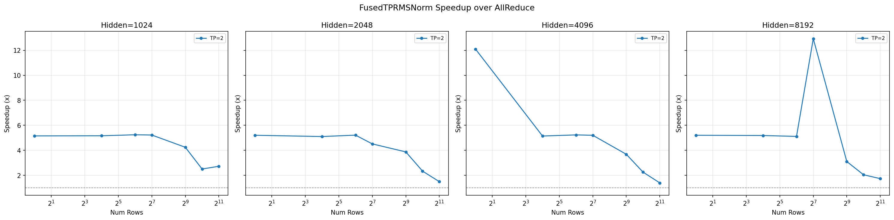
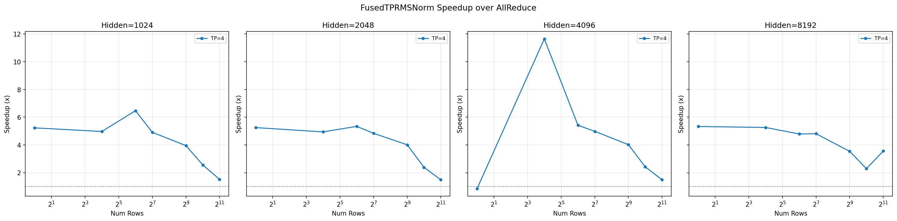

# FusedTPRMSNorm

基于 NVLink 直接通信的融合张量并行 RMSNorm，用 CUDA IPC Push 模型替代传统 AllReduce，降低通信延迟。

## 背景

标准张量并行 RMSNorm 的流程：

1. 各 rank 计算局部平方和（partial sum）
2. `AllReduce` 汇总所有 rank 的结果
3. 计算 RMSNorm

AllReduce 需要两步通信（Reduce + Broadcast），延迟较高。本项目采用 **Push 模型**：每个 rank 通过 NVLink 直接将 partial sum 写入所有其他 rank 的共享内存，各 rank 只需从本地内存读取即可获得全局结果，将通信压缩为一步。

## 架构

```
传统方案:  计算 → AllReduce(Reduce+Broadcast) → 归一化
本方案:    计算 → NVLink Push 到所有 rank → 本地读取 → 归一化
                 └─ 单步通信，融合进同一 kernel ──┘
```

### 核心机制

- **CUDA IPC 共享内存**：每个 rank 在本地 GPU 分配一块"邮箱"式缓冲区，通过 `cudaIpcGetMemHandle` / `cudaIpcOpenMemHandle` 映射到其他 rank 的地址空间
- **Push 模型**：每个 rank 主动将 partial sum 写入所有 rank 的邮箱中属于自己的 slot，而非通过集合通信收集
- **Generation 计数器**：用于同步——写入 partial sum 后递增 generation，读取方轮询 generation 确认数据就绪
- **Release-Acquire 内存序**：写端用 `st_release.sys` 保证 partial sum 先于 generation 可见，读端用 `ld_acquire.sys` 保证读 partial sum 不会重排到确认 generation 之前

### 缓冲区布局

每个 rank 的本地缓冲区（以 `tp_size=4, num_max_rows=65536` 为例）：

```
┌──────────────────────────────────────────┐
│  partial_sums[4][65536]                  │  每个 rank 一个 slot
│    [0][..] ← rank 0 通过 NVLink 远程写入 │
│    [1][..] ← rank 1 通过 NVLink 远程写入 │
│    [2][..] ← 自己本地计算写入            │
│    [3][..] ← rank 3 通过 NVLink 远程写入 │
├──────────────────────────────────────────┤
│  generation[4][65536]                    │  代数计数器
└──────────────────────────────────────────┘
```

## 项目结构

```
.
├── csrc/
│   ├── common.hpp          # IpcHandle 结构体、常量定义
│   ├── bindings.cpp        # CommBuffer 类 + pybind11 绑定
│   └── rmsnorm_tp.cu       # CUDA kernel 实现
├── rmsnorm_tp/
│   └── __init__.py         # Python 接口（FusedTPRMSNorm 类）
├── test_rmsnorm_tp.py      # 正确性测试 & 性能基准
├── setup.py                # 构建配置
└── pyproject.toml          # PEP 517/518 构建声明
```

## 环境要求

- Python >= 3.10
- PyTorch >= 2.0
- CUDA Toolkit（支持 sm_90a / sm_100）
- 多 GPU 节点（NVLink 互联）
- NCCL 后端

## 构建

```bash
python setup.py install
```

## 使用

```python
import torch
import torch.distributed as dist
from rmsnorm_tp import FusedTPRMSNorm

# 初始化分布式环境
dist.init_process_group(backend="nccl")
tp_group = dist.group.WORLD
rank = dist.get_rank()
tp_size = dist.get_world_size()

# 初始化（只需一次，通信通道在构造时建立）
fused_norm = FusedTPRMSNorm(hidden_dim=4096, eps=1e-6, tp_group=tp_group)

# 训练循环中反复调用
for batch in dataloader:
    # x: [num_rows, local_hidden_dim], weight: [local_hidden_dim]
    out = fused_norm.forward(x, weight)

# 销毁
fused_norm.destroy()
```

### 注意事项

- `FusedTPRMSNorm` 应在训练开始时初始化一次，反复调用 `forward()`，避免重复建立 IPC 通道
- `num_max_rows` 默认为 65536，`forward` 时行数不能超过此值
- 每个 rank 额外占用约 `tp_size × num_max_rows × 8` 字节显存（tp_size=4 时约 2 MB）
- 仅支持同节点多 GPU（IPC 共享内存不能跨节点）

## 测试

```bash
# 2 GPU 测试
torchrun --nproc_per_node=2 test_rmsnorm_tp.py

# 4 GPU 测试
torchrun --nproc_per_node=4 test_rmsnorm_tp.py
```

测试内容包括：
- 正确性验证（与 AllReduce 参考实现对比）
- 多种 hidden_dim / num_rows 组合测试
- 性能基准（对比参考实现的延迟和加速比）

## 性能基准

```bash
# 2 GPU
torchrun --nproc_per_node=2 bench_rmsnorm_tp.py

# 4 GPU 
torchrun --nproc_per_node=4 bench_rmsnorm_tp.py
```

输出文件：
- `bench_result.png` — 加速比对比图

## 性能

**TP=2 (2 GPU)**



**TP=4 (4 GPU)**



## Kernel 执行流程

每个 CTA 处理一行 token，执行五个阶段：

1. **计算局部平方和**：向量化（float4）读取输入，warp + block 级规约
2. **Push 到所有 rank**：前 `tp_size` 个线程各负责一个目标 rank，写 partial sum + release 写 generation
3. **轮询本地 generation**：等待所有 rank 的数据就绪，acquire 建立同步
4. **汇总全局方差**：从本地缓冲区读取所有 rank 的 partial sum 求和
5. **归一化**：向量化（float4）计算 `x * inv_rms * weight`
